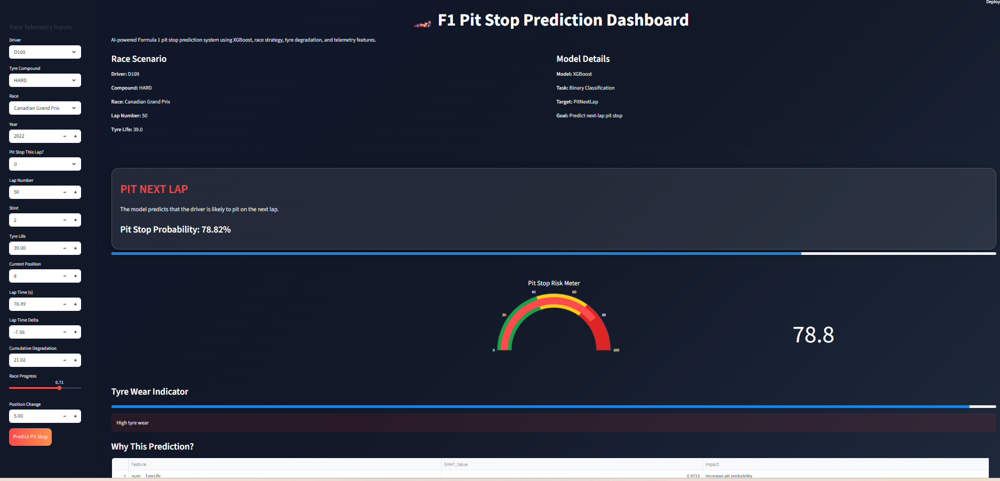

#  F1 Pit Stop Prediction Dashboard

An AI-powered Formula 1 pit stop prediction system built using Machine Learning, XGBoost, SHAP Explainability, and Streamlit.

This project predicts whether a Formula 1 driver is likely to pit on the next lap using race telemetry, tyre degradation, and strategy-related features.

---

# Dataset

The dataset used in this project was obtained from Kaggle.

The data was used solely for educational and portfolio purposes.

---

# Business Problem

In Formula 1, pit stop strategy can determine race outcomes. Teams continuously analyze tyre degradation, race pace, track position, and race conditions to decide when a driver should pit.

This project aims to predict whether a driver is likely to make a pit stop on the next lap using machine learning techniques.

---

#  Project Features

- Predicts next-lap pit stop decisions
- XGBoost machine learning model
- SHAP explainability dashboard
- Interactive Streamlit web application
- Modern F1-inspired UI/UX
- Pit stop probability gauge
- Tyre wear visualization
- Real race telemetry inputs
- Feature engineering pipeline

---

#  Machine Learning Workflow

## 1. Data Preprocessing
- Handled categorical variables
- One-hot encoding
- Feature scaling
- Train-test split

## 2. Feature Engineering
Created advanced racing strategy features such as:

- TyreLife_Ratio
- PaceLoss_PerLap
- Deg_PerLap
- PitWindow
- RacePhase
- LongStint
- AggressiveDeg

## 3. Models Tested

- Logistic Regression
- Random Forest
- XGBoost

XGBoost achieved the best overall performance.

---

#  Model Performance

| Metric | Score |
|---|---|
| Accuracy | 89.6% |
| Precision | 74.3% |
| Recall | 73.2% |
| F1 Score | 73.7% |
| ROC-AUC | 94.7% |

# Dashboard Screenshots

## Homepage

---

# Explainable AI

The dashboard includes SHAP explainability to understand:

- Why the model predicts a pit stop
- Which features increase pit probability
- Which features decrease pit probability

---

# Tech Stack

- Python
- Pandas
- NumPy
- Scikit-learn
- XGBoost
- SHAP
- Plotly
- Streamlit

---

# Project Structure

```bash
F1_Pit_Stop_Prediction/
│
├── app.py
├── README.md
├── requirements.txt
├── .gitignore
│
├── data/
│   └── raw/
│
├── models/
│   └── f1_pit_stop_final_pipeline.pkl
│
└── venv/

---

# Future Improvements

- Integrate real-time F1 telemetry APIs
- Deploy dashboard to cloud infrastructure
- Add race-specific strategy recommendations
- Train deep learning models for enhanced predictions
- Incorporate weather and track condition data